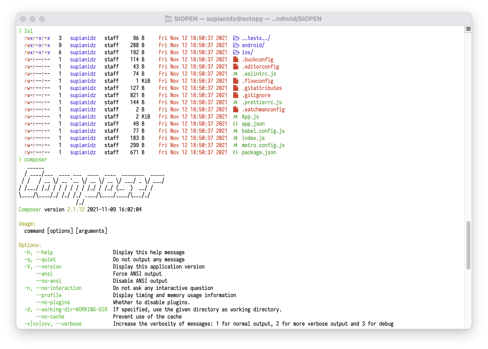

# My DOTFILES

This is my basic configuration for **MacOS**.

## INSTALLATION

You can install them by cloning the repository as .dotfiles in your home directory and running the bootstrap script.

```shell
git clone --depth=1 https://github.com/SupianIDz/DOTFILES.git $HOME/.dotfiles
```

```shell
cd $HOME/.dotfiles
```

```shell
chmod a+x install
```

```shell
./install
```

Feel free to create an issue on this repo if you have any questions about them.


